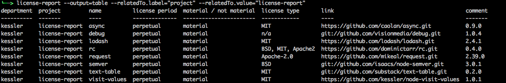
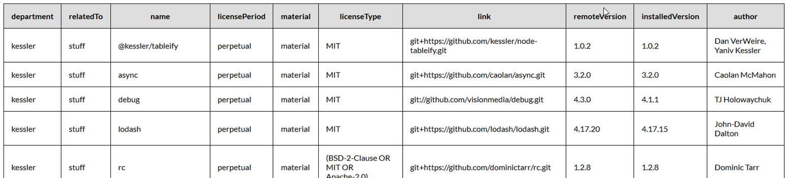
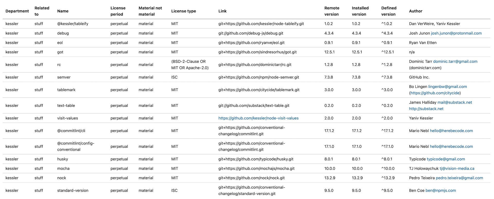

# NPM License Report Tool

[](https://github.com/kefranabg/readme-md-generator/blob/master/LICENSE)

> Generate a license report for the projects dependencies.

## Installation
```
npm install -g license-report
```
## Functionality
`license-report` gets the dependencies of a program or package from its  `package.json` file and for each dependency adds the installed version, the license type and the author from the corresponding `package.json` file in the `node_modules` directory and the latest available version and other data from the (npm) registry where this package was installed from.

## Prerequisites
1. The dependencies of the project under inspection must be installed so that the node_modules directory exists in the path of the `package.json` file.
2. The registry defined in the `registry` configuration setting must be accessible (default: 'https://registry.npmjs.org/').

## Configuration

### Run license-report without options:
By default, `license-report` outputs all licenses from `dependencies`, `devDependencies`, `optionalDependencies` and `peerDependencies`.
```
cd your/project/
license-report
```

### Select dependencies:

To specify one or some dependency types, use configuration options, e.g.
```
license-report --only=dev
```
```
license-report --only=prod
```
```
license-report --only=prod,opt,peer
```
The 'only' option is a comma separated list of the dependencies to use.  
Possible values are:
|value|segment of package.json|
|---|---|
|prod|dependencies|
|dev|devDependencies|
|opt|optionalDependencies|
|peer|peerDependencies|

### Explicit package.json:
To define the package.json to inspect, use the 'package' option.
```
license-report --package=/path/to/package.json
```

### Customize a field's label:
The configurable labels are used as column headers in table / csv / html output. For html output the labels of all fields in the output must be unique.
```
license-report --department.label=division
```

### Customize a fields default value:
Only applicable for the fields in the list later in this document and for "custom" fields (look for "Fields with data set in the configuration of license-report")
```
license-report --department.value=ninjaSquad
```

### Use another registry:
To define the registry, the remote data for packages are fetched from, use the 'registry' option.
```
license-report --registry=https://myregistry.com/
```

### Registry with authorization:
To use a npm registry that requires authorization, the option `npmTokenEnvVar` must contain the name of an environment variable that contains the required npm authorization token (the default name is 'NPM_TOKEN'). An example:
```
# if the name of the environment variable containing the bearer token for npm authorization is 'NPM_TOKEN'
license-report --registry=https://myregistry.com/ --npmTokenEnvVar=NPM_TOKEN
```
The name of this environment variable (in the example: 'npm_token') should not be added as an option to the license-report config file, as this implies a severe security risk, when this file is checked in into a git repository. A warning is emitted if such an option is found in the config file.

### Generate different outputs:
```
license-report --output=table
license-report --output=json
license-report --output=csv
license-report --output=html
license-report --output=markdown

# replace default ',' separator with something else
license-report --output=csv --delimiter="|" 

# output csv headers (fields) on first row
license-report --output=csv --csvHeaders

# use custom stylesheet for html output
license-report --output=html --html.cssFile=/a/b/c.css

# see the output immediately in your browser, use hcat
license-report --output=html | hcat
```
When using the 'hcat' package to open the result in a browser, this package must be globally installed with `npm i -g hcat`.

### Select fields for output:
If only a few fields are required in the output, the easiest way of selecting the fields is via --fields command line arguments.

```
# set options with command line arguments
license-report --output=csv --fields=name --fields=installedVersion
```

If more fields are needed, the best way is to use a custom config file, that contains a fields array.
```
# set options with command line option for custom (partial) config file
license-report --output=csv --config license-report-config.json
```
```
# example of config file for backward compatible output:
{
  "fields": [
    "department",
    "relatedTo",
    "name",
    "licensePeriod",
    "material",
    "licenseType",
    "link",
    "comment",
    "installedVersion",
    "author"
  ]
}
```
Besides the 'build-in' fields ("department", "name", "installedVersion", "author" "comment", "licensePeriod", "licenseType", "link", "material", "relatedTo"), any field allowed in a package.json can be used in the fields array (as "custom" field).

When using "custom" field, an element named like the "custom" field with 2 properties must be added: "value" - the default value for this field - and "label - the "heading" for generated columns. Here is an example for adding the 'homepage' field:
```
  "fields": [
    "name",
    "installedVersion",
    "homepage"
  ],
  "homepage": {
    "value": 'n/a',
    "label": 'Homepage'
  }
```

### Exclude packages:
With the 'exclude' option, single packages can be excluded from the output.
```
license-report --exclude=async --exclude=rc
```

Using the 'excludeRegex' option, packages can be excluded from the output using a regular expression.
```
license-report --excludeRegex=@mycompany\/.*
```

## Format output

### Markdown Options
If you want to change the default markdown table look and feel, e.g. center-align the text, you have to use a custom config file (`--config=license-report-config.json`) and in the config file use the `tablemarkConfig` property. 

Example config for markdown table with center-aligned content:
```JSON
"output": "markdown",
"fields": [
    "department",
    "relatedTo",
    "name",
    "licensePeriod",
    "material",
    "licenseType",
    "link",
    "comment",
    "installedVersion",
    "author"
  ],
"tablemarkOptions": {
  "columns": [
    { "name" : "department", "align": "center" },
    { "name" : "relatedTo", "align": "center" },
    { "name" : "name", "align": "center" },
    { "name" : "licensePeriod", "align": "center" },
    { "name" : "material", "align": "center" },
    { "name" : "licenseType", "align": "center" },
    { "name" : "link", "align": "center" },
    { "name" : "comment", "align": "center" },
    { "name" : "installedVersion", "align": "center" },
    { "name" : "author", "align": "center" }
  ]
}
```
For an explanation of all available options see https://github.com/haltcase/tablemark

## Screenshots





## "Build-in" fields
Fields with data of the installed packages:
| fieldname | column title | data source |
|---|---|---|
| name | name | name of the package |
| licenseType | license type | type of the license of the package (e.g. MIT) |
| link | link | link to the repository of the package |
| installedFrom | installed from | the download source for the installed package (optional field) |
| remoteVersion | remote version | latest available version of the package in the registry following defined semver range (can be different from the installed version) |
| installedVersion | installed version | installed version of the package (can be different from the remote version) |
| definedVersion | defined version | version of the package as defined in the (dev-) dependencies entry (can start with a semver range character) |
| latestRemoteVersion | latest remote version | latest version of the package available in the registry (optional field) |
| latestRemoteModified | latest remote modified | last modification date of the package in the registry (optional field) |
| comment | comment | deprecated (replaced by field 'remoteVersion'); will be removed in a future version |
| author | author | author of the package |

&nbsp;   
Fields with data set in the configuration of license-report:

| fieldname | column title | set value |
|--|---|---|
| department | department | --department.value=kessler |
| relatedTo | related to | --relatedTo.value=stuff |
| licensePeriod | license period | --licensePeriod.value=perpetual |
| material | material / not material | --material.value=material |

## More configuration options
See `lib/config.js` for more details e.g. on customizing the generated html data.

license-report uses the 'rc' package for handling configuration. So it is possible to add options to the command line, use a custom (partial) configuration file or even a default configuration file in a project.

A default project configuration file must be placed in the project root path and be named `.license-reportrc`. The file format is 'json'. An example looks like this:
```
{
  "output": "table",
  "fields": [
    "name",
    "licenseType",
    "installedVersion",
    "definedVersion",
    "remoteVersion",
    "latestRemoteVersion",
    "latestRemoteModified",
    "author"
  ]
}
```

To find out what configuration options are available see the `/lib/config.js` file in the project source.

For more 'rc' configuration details see the [rc](https://github.com/dominictarr/rc) documentation.

## Debug report generation

By setting the debug environment variable as follows, detailed log information is generated during the report generation. For details see the documentation of the debug package on npm.
```
export DEBUG=license-report*
```

## Changelog
For list of changes and bugfixes, see [CHANGELOG.md](CHANGELOG.md).

## Contributing
The [CHANGELOG.md](CHANGELOG.md) is generated with `standard-changelog` (using the command `npm run release`).

To make this possible the commit messages must follow the [conventional commits specification](https://www.conventionalcommits.org/en/v1.0.0-beta.2/#specification).

```
<type>: <description>

<optional body>
```

The following is the list of supported types:
* build: changes that affect build components like build tool, ci pipeline, dependencies, project version, etc...
* chore: changes that aren't user-facing (e.g. merging branches).
* docs: changes that affect the documentation.
* feat: changes that introduce a new feature.
* fix: changes that patch a bug.
* perf: changes which improve performance.
* refactor: changes which neither fix a bug nor add a feature.
* revert: changes that revert a previous commit.
* style: changes that don't affect code logic, such as white-spaces, formatting, missing semi-colons.
* test: changes that add missing tests or correct existing tests.

To ensure the syntax of commit messages `commitlint` is used, triggered by `husky`. This feature must be activated with `npm run activate-commitlint` once for every local clone of `license-report`.


